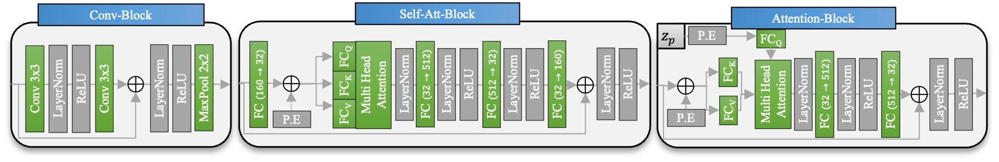

# Implicit Slice Agnostic Segmentation Model
Medical image segmentation is increasingly and successfully improved by the use of machine learning algorithms. Despite considerable success, most models focus on pixel-wise classification of the tissue instead of considering the region of interest as a coherent 3D shape. 
This work introduces an Implicit Slice Agnostic Segmentation (ISAS) model that allows coordinate-based segmentation in a continuous 3D space instead of pixel-wise classification.
This is enabled via an encoder-decoder architecture with an encoder that is able to generate features for each coordinate in a continuous 3D space. The decoder performs a classification of given input coordinates conditional on the encoded features. Given the object-specific features, the whole shape to be segmented can thus be implicitly represented by the decoder.
This makes it possible to segment the region of interest at practically any resolution.
Additionally, because the distance and quantity of individual input slices can vary, extrapolation to unknown regions of the shape and shape reconstruction with sparse input slices are both feasible.
The model is compared to standard 2D and 3D UNet models for the task of lung segmentation.
The experiments reveal that the costs for the additional flexibility are minor losses in segmentation quality in the case of equidistant dense CT slice inputs. In addition, the flexibility of the model in segmenting non-equidistant and sparse CT slice inputs is demonstrated. 
Based on the findings, the ISAS model's architecture may also be appropriate for other input data different from CT images, which are not equidistant or whose information content is limited in some areas of the domain that is considered.

# Architecture
__Encoder__ 

__Blocks__ 

__Decoder__ 

# Results
## Trainable Features
  

## Benchmarking
__Main Models (3D)__  
  
__Main Models (2D)__   
  
__All Models__  
  

## Reconstructions
__Non-ARDS lung__  
  
__ARDS lung__  
  
__Interpolation 2D UNet vs. ISAS (Input: 5 CT slices)__  
  
## Morphing
__PIP Values__ 

__Different Lungs__ 

